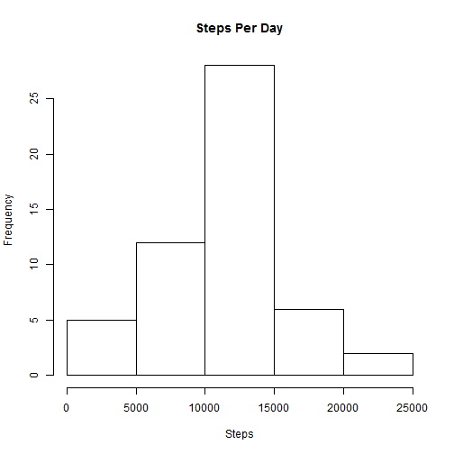
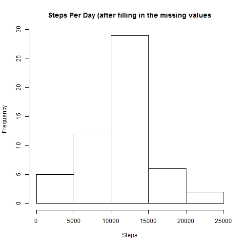
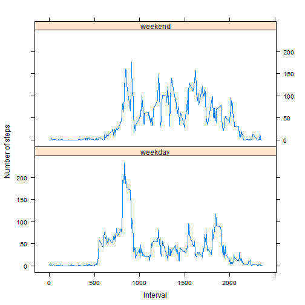

# Activity Monitoring

It is now possible to collect a large amount of data about personal movement using activity monitoring devices such as a Fitbit, Nike Fuelband, or Jawbone Up. These type of devices are part of the "quantified self" movement - a group of enthusiasts who take measurements about themselves regularly to improve their health, to find patterns in their behavior, or because they are tech geeks. But these data remain under-utilized both because the raw data are hard to obtain and there is a lack of statistical methods and software for processing and interpreting the data.

The data in this report is from a personal activity monitoring device. This device collects data at 5 minute intervals through out the day. The data consists of two months of data from an anonymous individual collected during the months of October and November, 2012 and include the number of steps taken in 5 minute intervals each day.

The data can be downloaded from the [course web site](https://d396qusza40orc.cloudfront.net/repdata%2Fdata%2Factivity.zip).

The variables included in this dataset are:

    1. steps: Number of steps taking in a 5-minute interval (missing values are coded as NA)    
    2. date: The date on which the measurement was taken in YYYY-MM-DD format    
    3. interval: Identifier for the 5-minute interval in which measurement was taken
    

The dataset is stored in a comma-separated-value (CSV) file and there are a total of 17,568 observations in it.

Load the dataset into R and transform the date field into Date type.

```r
activityData <- read.csv("activity.csv", na.strings="NA")
activityData <- transform(activityData, date = as.Date(activityData$date))
```

The histogram of total number of steps taken per day (ignore the missing values in dataset)

```r
#Compute the total number of steps taken per day.
stepsPerDay<-aggregate(steps ~ date, 
                       data=activityData, 
                       FUN="sum", 
                       na.action=na.omit)
hist(stepsPerDay$steps, xlab="Steps", main="Steps Per Day")
```

 

The mean and median of total number of steps taken per day is

```r
mean(stepsPerDay$steps)
```

```
## [1] 10766.19
```

```r
median(stepsPerDay$steps)
```

```
## [1] 10765
```

The time series plot of the 5-minute interval (x-axis) and the average number of steps taken, averaged across all days (y-axis) is as below

```r
require(lattice)
avgStepsByInterval<-aggregate(steps ~ interval, 
                              data=activityData, 
                              FUN="mean", 
                              na.action=na.omit)
xyplot(steps ~ interval, data = avgStepsByInterval, type="l")
```

 

The 5-minute interval, on average across all the days in the dataset, that contains the maximum number of steps is

```r
avgStepsByInterval[avgStepsByInterval$steps>=max(avgStepsByInterval$steps),][,1]
```

```
## [1] 835
```


The total number of missing values in the dataset (i.e. the total number of rows with NAs)

```r
nrow(activityData) - nrow(activityData[complete.cases(activityData),])
```

```
## [1] 2304
```

Let's fill in the missing values with the mean for that 5-minute interval across all days and create a new dataset. Let's round the mean assuming the steps are integers.


```r
completeData <- activityData
naInd <- which(is.na(completeData), arr.ind = T)
completeData[naInd[,1],1] <-
    round(avgStepsByInterval[avgStepsByInterval$interval == completeData[naInd[,1],3],2], digits=0)
head(completeData)
```

```
##   steps       date interval
## 1     2 2012-10-01        0
## 2     0 2012-10-01        5
## 3     0 2012-10-01       10
## 4     0 2012-10-01       15
## 5     0 2012-10-01       20
## 6     2 2012-10-01       25
```

The histogram of the total number of steps taken each day (after imputing missing values) is

```r
# Compute the total number of steps taken per day on the new dataset
avgStepsByInt <- aggregate(steps ~ date, 
                           data=completeData, 
                           FUN="sum", 
                           na.action=na.omit)
hist(avgStepsByInt$steps, xlab="Steps", main="Steps Per Day (after filling in the missing values")
```

 

The mean and median of total number of steps taken per day (after filling in missing values) is

```r
mean(avgStepsByInt$steps)
```

```
## [1] 10766.11
```

```r
median(avgStepsByInt$steps)
```

```
## [1] 10763.5
```

Note that the mean and  median  of total number of steps taken per day are not changed (significantly) by imputing the missing values with proper strategy.

Let's add a new factor variable in the new dataset with two levels - "weekday" and "weekend" indicating whether a given date is a weekday or weekend day.

```r
completeData$daytype <- as.factor(ifelse(weekdays(completeData$date) %in% c("Saturday","Sunday"), "weekend", "weekday"))
head(completeData)
```

```
##   steps       date interval daytype
## 1     2 2012-10-01        0 weekday
## 2     0 2012-10-01        5 weekday
## 3     0 2012-10-01       10 weekday
## 4     0 2012-10-01       15 weekday
## 5     0 2012-10-01       20 weekday
## 6     2 2012-10-01       25 weekday
```

A panel plot containing a time series plot of the 5-minute interval (x-axis) and the average number of steps taken, averaged across all weekday days or weekend days (y-axis) is

```r
#Compute the aggregate steps by day type and interval
an<-aggregate(steps ~ daytype+interval, 
              data=completeData, 
              FUN="mean", 
              na.action=na.omit)
xyplot(steps ~ interval|daytype, data = an, type="l", 
       xlab="Interval", 
       ylab="Number of steps", 
       layout=c(1, 2))
```

 


